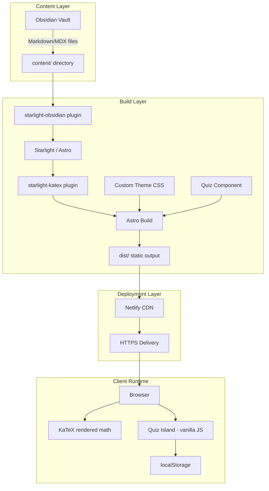

# Design Document: Math Website

## Overview

This design describes a static math learning website for adults, built with Astro + Starlight. Content is authored in Obsidian and synced via the starlight-obsidian plugin. Mathematical notation is rendered with KaTeX via starlight-katex. Each lesson page follows a consistent structure ending with an interactive multiple-choice quiz implemented as a reusable Astro island component with vanilla JavaScript. The site deploys to Netlify as a fully static build with no backend.

The primary architectural goals are:

- Zero-backend operation: all interactivity is client-side
- Content-first: Obsidian vault is the single source of truth for lessons
- Accessibility: WCAG-aligned quiz interactions, semantic HTML, keyboard navigation
- Performance: static HTML with selective hydration via Astro islands

## Architecture



### Key Architectural Decisions

1. **Astro Islands for Quiz Only**: The quiz is the only interactive component. Everything else is static HTML. This keeps JS payload minimal.

2. **starlight-obsidian for Content Sync**: Rather than a custom content pipeline, we rely on the starlight-obsidian plugin to map the Obsidian vault folder structure directly to Starlight sidebar sections. This means the Obsidian folder names (Arithmetic, Algebra Basics, etc.) become the sidebar group labels automatically.

3. **Vanilla JS for Quiz**: No React/Vue/Svelte. The quiz component uses vanilla JavaScript within an Astro island (`client:load` directive). This avoids shipping a framework runtime for a simple multiple-choice interaction.

4. **localStorage for Persistence**: Quiz state is stored per-quiz in localStorage keyed by a quiz identifier (derived from the page slug). No cookies, no sessions, no backend.

5. **KaTeX over MathJax**: starlight-katex uses KaTeX which is faster to render and produces smaller output than MathJax. It handles the vast majority of LaTeX math notation needed for this content level.

## Components and Interfaces

### 1. Astro Configuration (`astro.config.mjs`)

Central configuration file that wires together Starlight, starlight-obsidian, and starlight-katex.

```typescript
// astro.config.mjs
import { defineConfig } from "astro/config";
import starlight from "@astrojs/starlight";
import starlightObsidian from "starlight-obsidian";
import starlightKatex from "starlight-katex";

export default defineConfig({
  integrations: [
    starlight({
      title: "Math Made Clear",
      plugins: [
        starlightObsidian({ vault: "./obsidian-vault" }),
        starlightKatex(),
      ],
      customCss: ["./src/styles/custom.css"],
      social: [],
    }),
  ],
});
```

### 2. Quiz Component (`src/components/Quiz.astro`)

A reusable Astro island component that renders a multiple-choice quiz. It accepts quiz data as a JSON prop and manages all interaction with vanilla JS.

**Interface:**

```typescript
interface QuizProps {
  quizId: string; // Unique identifier for localStorage keying
  questions: QuizQuestion[];
}

interface QuizQuestion {
  id: string; // Unique question identifier
  text: string; // Question text (may contain KaTeX markup)
  options: string[]; // Exactly 4 answer options
  correctIndex: number; // Index (0-3) of the correct answer
  explanation: string; // Explanation shown after answering
}

interface QuizState {
  answers: Record<string, number>; // questionId -> selected option index
  completed: boolean;
  score: number; // Number of correct answers
  total: number; // Total number of questions
}
```

**Usage in MDX:**

```mdx
---
title: Adding Fractions
---

# Adding Fractions

... lesson content ...

import Quiz from "../../components/Quiz.astro";

<Quiz
  client:load
  quizId="arithmetic-adding-fractions"
  questions={[
    {
      id: "q1",
      text: "What is $\\frac{1}{2} + \\frac{1}{3}$?",
      options: [
        "$\\frac{2}{5}$",
        "$\\frac{5}{6}$",
        "$\\frac{1}{6}$",
        "$\\frac{2}{6}$",
      ],
      correctIndex: 1,
      explanation:
        "Find a common denominator (6), then add: $\\frac{3}{6} + \\frac{2}{6} = \\frac{5}{6}$",
    },
  ]}
/>
```

### 3. Quiz State Manager (`src/lib/quiz-state.ts`)

A pure utility module for reading/writing quiz state to localStorage.

```typescript
// Key format: "quiz-state:{quizId}"
function getStorageKey(quizId: string): string;
function loadQuizState(quizId: string): QuizState | null;
function saveQuizState(quizId: string, state: QuizState): void;
function clearQuizState(quizId: string): void;
```

### 4. Custom Theme (`src/styles/custom.css`)

Overrides Starlight's CSS custom properties to apply the cool gray palette, accent colors, and Inter font.

```css
/* Key custom properties */
:root {
  --sl-color-accent-low: #0d6efd20;
  --sl-color-accent: #0d6efd;
  --sl-color-accent-high: #0a58ca;
  --sl-font: "Inter", sans-serif;
  --sl-color-bg: #f8f9fa;
  --sl-color-bg-sidebar: #f1f3f5;
  /* Quiz-specific tokens */
  --quiz-correct: #198754;
  --quiz-incorrect: #dc3545;
  --quiz-highlight: #fd7e14;
  --quiz-special: #6f42c1;
}

:root[data-theme="dark"] {
  --sl-color-bg: #121212;
  --sl-color-bg-sidebar: #1e1e1e;
}
```

### 5. Homepage (`src/content/docs/index.mdx`)

Custom landing page using Starlight's built-in hero component configuration or a custom MDX layout.

**Structure:**

- Hero section with tagline: "Math Made Clear for Adults – Start Fresh, No Judgment"
- Grid of subject area cards linking to each section's first lesson
- Supportive introductory copy

### 6. Content Directory Structure

```
obsidian-vault/
├── Arithmetic/
│   ├── adding-whole-numbers.md
│   ├── subtracting-whole-numbers.md
│   └── ...
├── Algebra Basics/
│   ├── variables-and-expressions.md
│   └── ...
├── Linear Algebra/
│   └── ...
├── Graphics Math/
│   └── ...
├── AI Art Math/
│   └── ...
└── Esoteric Patterns/
    └── ...
```

starlight-obsidian maps these folders to Starlight sidebar groups automatically. No manual sidebar configuration is needed for content pages.

### 7. Netlify Configuration (`netlify.toml`)

```toml
[build]
  command = "npm run build"
  publish = "dist"

[build.environment]
  NODE_VERSION = "20"
```

## Data Models

### Quiz Data (passed as props)

```typescript
interface QuizQuestion {
  id: string;
  text: string; // Supports KaTeX notation
  options: [string, string, string, string]; // Exactly 4 options
  correctIndex: 0 | 1 | 2 | 3;
  explanation: string; // Supports KaTeX notation
}

interface QuizData {
  quizId: string; // Unique per lesson, e.g. "arithmetic-adding-fractions"
  questions: QuizQuestion[]; // 3 to 8 questions
}
```

### Quiz State (localStorage)

```typescript
interface QuizState {
  answers: Record<string, number>; // questionId -> selectedIndex
  completed: boolean;
  score: number;
  total: number;
  timestamp: number; // Date.now() when last updated
}
```

**Storage key pattern:** `quiz-state:{quizId}`

**Example localStorage entry:**

```json
{
  "quiz-state:arithmetic-adding-fractions": {
    "answers": { "q1": 1, "q2": 0, "q3": 2 },
    "completed": true,
    "score": 2,
    "total": 3,
    "timestamp": 1700000000000
  }
}
```

### Lesson Frontmatter

```yaml
---
title: "Adding Fractions"
description: "Learn how to add fractions with like and unlike denominators"
sidebar:
  order: 3
---
```

### Content Page Structure Convention

Each lesson follows this Markdown structure:

```markdown
# [Concept Title]

## What You'll Learn

Brief overview of the concept.

## The Concept

Explanatory text with inline math like $x + y$ and display math:
$$a^2 + b^2 = c^2$$

## Worked Example

Step-by-step walkthrough of a problem.

## Real-World Application

How this concept appears in everyday life.

:::note[You've Got This]
Encouraging message for the reader.
:::

## Quiz

<Quiz client:load quizId="..." questions={[...]} />
```

## Correctness Properties

_A property is a characteristic or behavior that should hold true across all valid executions of a system — essentially, a formal statement about what the system should do. Properties serve as the bridge between human-readable specifications and machine-verifiable correctness guarantees._

### Property 1: Quiz data validation

_For any_ quiz data object, the quiz should be accepted if and only if it contains between 3 and 8 questions (inclusive), each question has exactly 4 options, and each question's `correctIndex` is an integer in the range [0, 3]. Invalid quiz data should be rejected with an appropriate error.

**Validates: Requirements 5.1, 5.2, 5.3**

### Property 2: Answer feedback correctness

_For any_ quiz question and any selected answer index, the feedback displayed should indicate "correct" if and only if the selected index equals the question's `correctIndex`, and should indicate "incorrect" otherwise. In both cases, the question's explanation text should be included in the feedback.

**Validates: Requirements 5.4, 5.5**

### Property 3: Score computation

_For any_ quiz with N questions and any combination of answers, the computed score should equal the number of questions where the selected answer index equals the question's `correctIndex`. The total should equal N.

**Validates: Requirements 5.6, 13.2**

### Property 4: Quiz state round-trip through localStorage

_For any_ valid QuizState object, serializing it to localStorage via `saveQuizState` and then deserializing it via `loadQuizState` with the same quizId should produce an equivalent QuizState object.

**Validates: Requirements 6.1, 6.2**

### Property 5: Retry clears all state

_For any_ quiz with saved state in localStorage, calling `clearQuizState` should result in `loadQuizState` returning null for that quizId. No other quiz's state should be affected.

**Validates: Requirements 5.7, 6.3**

### Property 6: Quiz renders with accessible markup

_For any_ valid quiz data, the rendered HTML output should contain: a `fieldset` element for each question, a `legend` element within each fieldset, `label` elements for each option, ARIA attributes (`role`, `aria-label`, or `aria-labelledby`) on all interactive elements, and a container with `aria-live` attribute for feedback announcements.

**Validates: Requirements 7.2, 7.4**

## Error Handling

### Quiz Data Validation Errors

| Error Condition                                                                  | Handling                                                                                        |
| -------------------------------------------------------------------------------- | ----------------------------------------------------------------------------------------------- |
| Quiz has fewer than 3 or more than 8 questions                                   | Render an error message in place of the quiz. Log a warning to the console for content authors. |
| Question has fewer or more than 4 options                                        | Reject the question. Render an error message indicating the malformed question.                 |
| `correctIndex` is out of range [0, 3]                                            | Reject the question. Render an error message.                                                   |
| Missing required fields (`id`, `text`, `options`, `correctIndex`, `explanation`) | Reject the question. Render an error message.                                                   |

### localStorage Errors

| Error Condition                                              | Handling                                                                                                |
| ------------------------------------------------------------ | ------------------------------------------------------------------------------------------------------- |
| localStorage is unavailable (private browsing, storage full) | Quiz functions normally without persistence. State is kept in memory only. A console warning is logged. |
| Stored data is corrupted or has unexpected shape             | Discard the corrupted data, start fresh. Log a warning.                                                 |
| Storage quota exceeded on save                               | Catch the error, continue without persistence. Log a warning.                                           |

### KaTeX Rendering Errors

Handled by the starlight-katex plugin. Per Requirement 4.4, syntax errors display raw LaTeX source. No custom error handling needed in our code.

### Build Errors

| Error Condition                      | Handling                                                                            |
| ------------------------------------ | ----------------------------------------------------------------------------------- |
| Obsidian vault path not found        | Astro build fails with a clear error from starlight-obsidian. Documented in README. |
| Invalid frontmatter in content files | Astro build fails with file-specific error. Content author fixes the file.          |

## Testing Strategy

### Unit Tests

Unit tests verify specific examples, edge cases, and integration points. Use Vitest as the test runner (standard for Astro projects).

**Quiz Data Validation:**

- Example: A quiz with exactly 3 questions and valid structure is accepted
- Example: A quiz with 0 questions is rejected
- Example: A quiz with 9 questions is rejected
- Edge case: A question with `correctIndex: -1` is rejected
- Edge case: A question with `correctIndex: 4` is rejected
- Edge case: A question with 3 options is rejected
- Edge case: A question with an empty `text` field

**Quiz State Manager:**

- Example: `loadQuizState` returns null for a quizId with no saved state
- Example: `clearQuizState` on a non-existent quizId does not throw
- Edge case: localStorage is unavailable (mock throws)
- Edge case: Stored JSON is malformed

**Score Computation:**

- Example: All correct answers → score equals total
- Example: All incorrect answers → score equals 0
- Edge case: Quiz with exactly 3 questions (minimum)
- Edge case: Quiz with exactly 8 questions (maximum)

### Property-Based Tests

Use `fast-check` as the property-based testing library. Each property test runs a minimum of 100 iterations.

**Configuration:**

```typescript
import fc from "fast-check";

// Generators
const quizQuestionArb = fc.record({
  id: fc.string({ minLength: 1, maxLength: 20 }),
  text: fc.string({ minLength: 1 }),
  options: fc.tuple(fc.string(), fc.string(), fc.string(), fc.string()),
  correctIndex: fc.integer({ min: 0, max: 3 }),
  explanation: fc.string({ minLength: 1 }),
});

const quizDataArb = fc.record({
  quizId: fc.string({ minLength: 1, maxLength: 50 }),
  questions: fc.array(quizQuestionArb, { minLength: 3, maxLength: 8 }),
});

const quizStateArb = fc.record({
  answers: fc.dictionary(fc.string(), fc.integer({ min: 0, max: 3 })),
  completed: fc.boolean(),
  score: fc.nat(),
  total: fc.nat(),
  timestamp: fc.nat(),
});
```

**Property Test Mapping:**

Each correctness property maps to a single property-based test:

1. **Feature: math-website, Property 1: Quiz data validation** — Generate random quiz data with valid and invalid shapes, verify the validation function accepts/rejects correctly.

2. **Feature: math-website, Property 2: Answer feedback correctness** — For random questions and random selected indices, verify feedback matches correctIndex comparison.

3. **Feature: math-website, Property 3: Score computation** — For random quizzes and random answer sets, verify score equals count of matching indices.

4. **Feature: math-website, Property 4: Quiz state round-trip** — For random QuizState objects, verify save then load produces equivalent state.

5. **Feature: math-website, Property 5: Retry clears all state** — For random quizIds with saved state, verify clear then load returns null.

6. **Feature: math-website, Property 6: Quiz accessible markup** — For random valid quiz data, verify rendered HTML contains required semantic and ARIA elements.
