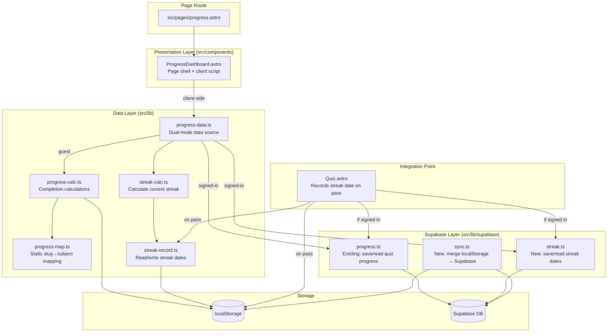
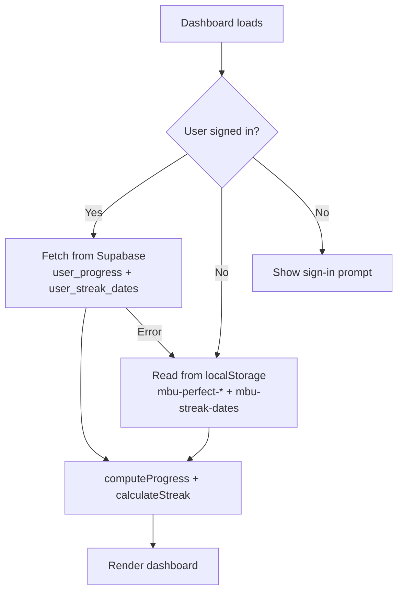
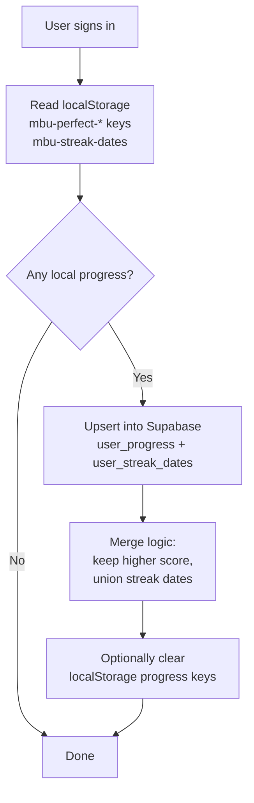
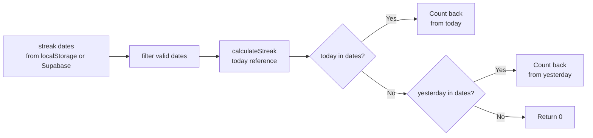

# Design Document: Progress Dashboard and Streaks

## Overview

This design adds a dedicated `/progress/` page to the Mom's Basement University site, providing learners with a single view of their quiz completion across all 12 subjects plus a consecutive-day streak counter.

The feature supports **dual-mode progress tracking**:

- **Guests** (not signed in) → progress is read from localStorage (`mbu-perfect-{slug}` keys and `mbu-streak-dates`)
- **Signed-in users** → progress is read from the Supabase `user_progress` table (cross-device), with streak dates stored in a `user_streak_dates` table
- **Sync on login** → when a user signs in, any localStorage progress is merged into their Supabase account
- **Guest prompt** → the dashboard shows a "Sign in to save progress across devices" CTA for unauthenticated visitors

The architecture prioritizes:

- **Pure, testable logic modules** separated from rendering
- **A static slug-to-subject mapping** (no DOM scraping)
- **Progressive enhancement** — the page works for guests with localStorage alone
- **Graceful degradation** — if Supabase is unavailable, falls back to localStorage
- **Full dark mode and accessibility support** consistent with the rest of the site

## Architecture



**Key Architectural Decisions:**

1. **Astro page route vs. Starlight content page**: Use a standalone `src/pages/progress.astro` page rather than a content doc. This avoids Starlight's sidebar rendering (the dashboard is not a lesson) and gives full control over layout. The page will import Starlight's base layout for header/footer consistency.

2. **Client-side rendering**: All progress calculations happen client-side via a `<script>` block. The page renders a skeleton, then hydrates with computed values after checking auth state.

3. **Dual-mode data source**: A new `progress-data.ts` module checks auth state first. If signed in, it fetches from Supabase. If not, it reads localStorage. This abstraction keeps the rendering layer agnostic to the data source.

4. **Pure utility modules**: `progress-calc.ts`, `streak-calc.ts`, and `streak-record.ts` are pure functions that accept data (a set of slugs, an array of dates) and return computed results. They don't care where the data came from.

5. **Static mapping module**: `progress-map.ts` exports the slug-to-subject mapping as a constant. This eliminates the homepage's reliance on sidebar DOM scraping.

6. **Sync on login**: A `sync.ts` module reads all `mbu-perfect-*` keys and `mbu-streak-dates` from localStorage, merges them into the user's Supabase records (upsert, no overwrite of existing server data), then optionally clears localStorage progress keys. This runs once after sign-in.

## Components and Interfaces

### Module: `src/lib/progress-map.ts`

```typescript
/** A subject entry in the curriculum */
export interface SubjectInfo {
  slug: string; // URL directory slug e.g. "arithmetic"
  label: string; // Display name e.g. "Arithmetic"
  aboutPath: string; // Link target e.g. "/arithmetic/about-arithmetic/"
  lessons: string[]; // Array of lesson slugs belonging to this subject
}

/** All 12 subjects in curriculum order, with their lesson slugs */
export const SUBJECTS: SubjectInfo[];

/** Total number of quizzes available across all subjects */
export const TOTAL_LESSONS: number; // 268

/** Lookup: slug → subject slug (for filtering unknown keys) */
export const SLUG_TO_SUBJECT: Map<string, string>;
```

### Module: `src/lib/progress-calc.ts`

```typescript
import type { SubjectInfo } from "./progress-map";

export interface SubjectProgress {
  subject: SubjectInfo;
  passed: number;
  total: number;
  percentage: number; // (passed/total)*100 as float, for color thresholds
}

export interface OverallProgress {
  totalPassed: number;
  totalAvailable: number; // 268
  overallPercentage: number; // floor((totalPassed/268)*100)
  subjects: SubjectProgress[];
}

/**
 * Given a set of passed lesson slugs and the subject mapping,
 * compute per-subject and overall progress.
 */
export function computeProgress(
  passedSlugs: Set<string>,
  subjects: SubjectInfo[],
  totalLessons: number,
): OverallProgress;

/**
 * Read all mbu-perfect-* keys from localStorage and return the set of slugs.
 * Returns empty set if localStorage is unavailable.
 */
export function readPassedSlugsFromLocalStorage(): Set<string>;

/**
 * Determine the progress bar color based on exact percentage.
 * 0% → null (no fill), 0 < pct < 50 → orange, 50 <= pct < 100 → blue, 100% → green
 */
export function getProgressColor(percentage: number): string | null;
```

### Module: `src/lib/progress-data.ts`

```typescript
import type { OverallProgress } from "./progress-calc";

export interface ProgressDataResult {
  progress: OverallProgress;
  streakDates: string[];
  isAuthenticated: boolean;
  error: string | null;
}

/**
 * Fetch progress data from the appropriate source based on auth state.
 * - If signed in: reads from Supabase user_progress + user_streak_dates
 * - If guest: reads from localStorage
 * - Falls back to localStorage if Supabase call fails
 */
export async function fetchProgressData(): Promise<ProgressDataResult>;
```

### Module: `src/lib/streak-record.ts`

```typescript
/**
 * Read the streak dates array from localStorage.
 * Returns empty array if key doesn't exist or localStorage is unavailable.
 * Filters out invalid date entries.
 */
export function readStreakDates(): string[];

/**
 * Record a date string to the streak dates array in localStorage.
 * Maintains sorted order, uniqueness, and max 365 entries.
 * No-op if localStorage is unavailable.
 */
export function recordStreakDate(dateStr: string): void;

/**
 * Get today's date in YYYY-MM-DD format (local timezone).
 */
export function getTodayDateStr(): string;

/** Validate a date string is in YYYY-MM-DD format and represents a real date */
export function isValidDateStr(str: string): boolean;
```

### Module: `src/lib/streak-calc.ts`

```typescript
/**
 * Calculate the current streak given an array of valid date strings
 * and a reference "today" date.
 *
 * Rules:
 * - If today is in the array, count consecutive days backwards from today
 * - If today is NOT but yesterday IS, count from yesterday backwards
 * - Otherwise return 0
 */
export function calculateStreak(dates: string[], today: string): number;

/**
 * Format streak for display: returns {value, label, hasStreak}
 */
export function formatStreak(streak: number): {
  value: number;
  label: string; // "day streak" or "days streak"
  hasStreak: boolean; // streak >= 1
};
```

### Module: `src/lib/supabase/streak.ts`

```typescript
/**
 * Read streak dates for the current user from Supabase.
 * Returns sorted array of YYYY-MM-DD date strings.
 */
export async function readStreakDatesFromSupabase(): Promise<string[]>;

/**
 * Record a streak date to Supabase for the current user.
 * Upserts to avoid duplicates.
 */
export async function recordStreakDateToSupabase(
  dateStr: string,
): Promise<boolean>;
```

### Module: `src/lib/supabase/sync.ts`

```typescript
/**
 * Merge localStorage progress into the signed-in user's Supabase account.
 * - Reads all mbu-perfect-* keys and upserts into user_progress
 * - Reads mbu-streak-dates and merges into user_streak_dates
 * - Does NOT overwrite higher scores already in Supabase
 * - Optionally clears localStorage progress keys after successful sync
 *
 * Should be called once after sign-in (e.g., from the auth modal callback).
 */
export async function syncLocalProgressToSupabase(options?: {
  clearLocalAfterSync?: boolean;
}): Promise<{ synced: number; errors: number }>;
```

### Component: `src/pages/progress.astro`

The page component will:

1. Import Starlight's base HTML layout (or use a minimal layout that includes the site header/footer)
2. Render a static skeleton with empty slots for dynamic data
3. Include a `<script>` that imports `fetchProgressData` and hydrates the page
4. Show a "Sign in to save progress across devices" banner for guests

```html
<!-- Simplified structure -->
<Layout title="Your Progress">
  <main class="progress-dashboard" aria-labelledby="progress-title">
    <h1 id="progress-title">Your Progress</h1>

    <!-- Guest prompt: shown when not authenticated -->
    <div class="progress-signin-prompt" hidden>
      <p>Sign in to save your progress across devices</p>
      <button class="progress-signin-btn">Sign In</button>
    </div>

    <section class="progress-stats" aria-label="Overall progress summary">
      <!-- Total passed, total available, overall %, streak -->
    </section>

    <div class="progress-grid" role="list">
      <!-- 12 subject cards rendered statically with data attributes -->
      <!-- Client script fills in the numbers -->
    </div>

    <p class="progress-error" hidden>Progress data could not be loaded.</p>
  </main>
</Layout>
```

### Integration: Quiz.astro Modification

The existing `showScore()` function in Quiz.astro will be extended:

1. Call `recordStreakDate(getTodayDateStr())` to write to localStorage (always)
2. If signed in, also call `recordStreakDateToSupabase(getTodayDateStr())` (fire-and-forget, non-blocking)

The existing `trySaveProgress()` already saves to Supabase when signed in.

## Data Models

### localStorage Schema (Guest Mode)

| Key                  | Type            | Description                                                                |
| -------------------- | --------------- | -------------------------------------------------------------------------- |
| `mbu-perfect-{slug}` | `"1"`           | Exists when lesson quiz is passed                                          |
| `mbu-streak-dates`   | `JSON string[]` | Array of `"YYYY-MM-DD"` date strings, sorted oldest-first, max 365 entries |
| `mbu-last-lesson`    | `JSON object`   | Existing: last visited lesson (unchanged)                                  |

### Supabase Schema (Signed-in Mode)

**Existing table: `user_progress`**

| Column         | Type    | Description                     |
| -------------- | ------- | ------------------------------- |
| `id`           | uuid    | Primary key                     |
| `user_id`      | uuid    | FK to auth.users (RLS enforced) |
| `lesson_slug`  | text    | e.g. "addition-and-subtraction" |
| `section_slug` | text    | e.g. "arithmetic"               |
| `completed`    | boolean | Quiz completed                  |
| `score`        | integer | Score percentage (0-100)        |
| `is_perfect`   | boolean | Score == 100                    |

**New table: `user_streak_dates`**

| Column        | Type      | Description                          |
| ------------- | --------- | ------------------------------------ |
| `id`          | uuid      | Primary key (auto-generated)         |
| `user_id`     | uuid      | FK to auth.users (RLS enforced)      |
| `streak_date` | date      | The calendar date of quiz completion |
| `created_at`  | timestamp | When the record was created          |

Unique constraint on `(user_id, streak_date)` to prevent duplicates.
RLS policy: users can only read/write their own rows.

### Static Subject Mapping Structure

```typescript
// Stored as a constant in progress-map.ts
const SUBJECTS: SubjectInfo[] = [
  {
    slug: "arithmetic",
    label: "Arithmetic",
    aboutPath: "/arithmetic/about-arithmetic/",
    lessons: ["about-arithmetic", "addition-and-subtraction", "multiplication", ...]
  },
  // ... 11 more subjects in curriculum order
];
```

The mapping contains exactly 268 lesson slugs distributed across 12 subjects. The order matches the Astro config sidebar order. Each subject's lesson list is derived from the actual files in `src/content/docs/{subject}/`.

### Progress Data Flow



### Sync on Login Flow



### Streak Calculation Flow



## Correctness Properties

_A property is a characteristic or behavior that should hold true across all valid executions of a system — essentially, a formal statement about what the system should do. Properties serve as the bridge between human-readable specifications and machine-verifiable correctness guarantees._

### Property 1: Progress bar color mapping

_For any_ ratio of passed quizzes to total quizzes (where total > 0), the color returned by `getProgressColor` SHALL be: `null` when the ratio is exactly 0, `"#f0883e"` (orange) when the ratio is greater than 0 and less than 0.5, `"#58a6ff"` (blue) when the ratio is at least 0.5 and less than 1.0, and `"#7ee787"` (green) when the ratio is exactly 1.0. The comparison SHALL use the exact floating-point ratio `passed / total`, not a rounded integer percentage.

**Validates: Requirements 3.1, 3.2, 3.3, 3.4, 3.6**

### Property 2: Subject completion count correctness

_For any_ set of passed lesson slugs and any subject mapping, the `computeProgress` function SHALL count only those slugs that appear in the subject's lesson list. Slugs not present in the mapping SHALL be excluded from all counts. The sum of all per-subject passed counts SHALL equal the overall totalPassed. This property holds regardless of whether the slugs came from localStorage or Supabase.

**Validates: Requirements 4.1, 4.5**

### Property 3: Overall completion percentage calculation

_For any_ integer `totalPassed` in the range [0, 268], the overall completion percentage SHALL equal `Math.floor((totalPassed / 268) * 100)`, yielding a value between 0 and 100 inclusive.

**Validates: Requirements 4.3**

### Property 4: Streak record structural invariants

_For any_ sequence of `recordStreakDate` calls with arbitrary date strings, the resulting streak dates array SHALL always satisfy: (a) all entries are valid YYYY-MM-DD date strings, (b) entries are in chronological order (oldest first), (c) no duplicate entries exist, and (d) the array length never exceeds 365. Furthermore, calling `recordStreakDate` with a date already in the array SHALL not change the array (idempotence).

**Validates: Requirements 5.2, 5.4, 5.5**

### Property 5: Streak calculation correctness

_For any_ array of valid date strings sorted chronologically, and any reference date "today", the `calculateStreak` function SHALL return: 0 if neither today nor the day before today appears in the array; otherwise, the count of consecutive calendar days ending at the most recent qualifying date (today if present, else yesterday) counting backwards. Each day in the consecutive sequence must differ from the next by exactly one calendar day. Invalid date entries in the input SHALL be ignored.

**Validates: Requirements 6.1, 6.2, 6.3, 6.4, 6.5, 6.6**

### Property 6: Subject card rendering invariants

_For any_ subject with a total lesson count > 0 and a passed count in [0, total], the rendered subject card SHALL: display the text `"{passed} / {total} lessons"`, set `aria-valuenow` to `passed`, `aria-valuemin` to `0`, `aria-valuemax` to `total`, include an `aria-label` matching the format `"{label}: {passed} of {total} lessons complete ({pct}%)"` where pct = `Math.round((passed/total)*100)`, and display a visible text label showing the percentage.

**Validates: Requirements 2.2, 2.3, 11.1, 11.2, 11.6**

### Property 7: Streak display pluralization

_For any_ non-negative integer streak value, the `formatStreak` function SHALL return `"day streak"` when the value is exactly 1, and `"days streak"` for all other values (including 0).

**Validates: Requirements 7.2, 7.3**

### Property 8: Data source selection

_For any_ page load of the dashboard, the `fetchProgressData` function SHALL: check auth state, return Supabase data if authenticated, return localStorage data if not authenticated, and fall back to localStorage if Supabase call fails. The `isAuthenticated` flag in the result SHALL accurately reflect which source was used.

**Validates: Dual-mode requirement**

### Property 9: Sync merge correctness

_For any_ set of localStorage slugs and any existing Supabase records for the same user, the sync operation SHALL: (a) add any localStorage slugs not already in Supabase, (b) never overwrite a higher score in Supabase with a lower local score, (c) union streak dates from both sources without duplicates, and (d) result in a Supabase state that is a superset of both the pre-existing Supabase data and the localStorage data.

**Validates: Sync-on-login requirement**

## Error Handling

| Scenario                                                  | Behavior                                                                                                                                           |
| --------------------------------------------------------- | -------------------------------------------------------------------------------------------------------------------------------------------------- |
| localStorage unavailable (private browsing, storage full) | All progress values display as 0. Error message shown: "Progress data could not be loaded." Streak recording in Quiz.astro silently no-ops.        |
| `mbu-streak-dates` contains malformed JSON                | Treat as empty array. Log warning to console. Do not corrupt other keys.                                                                           |
| Streak dates array contains invalid entries               | Filter them out before calculation. Only valid YYYY-MM-DD strings are used.                                                                        |
| Unknown slugs in `mbu-perfect-*` keys                     | Silently ignored — not counted in any subject or overall total.                                                                                    |
| Supabase unavailable or network error                     | Fall back to localStorage. Show data with a subtle note: "Showing local progress only." Do not block the page.                                     |
| Supabase auth session expired                             | Treat as guest. Show localStorage data + sign-in prompt.                                                                                           |
| Sync fails mid-operation                                  | Do not clear localStorage. User can retry sync on next login. Partial upserts are fine (idempotent).                                               |
| Future dates in streak record                             | Treated as valid dates but will not contribute to streak unless they happen to be consecutive with today/yesterday (unlikely edge case, harmless). |

All localStorage interactions are wrapped in try/catch. All Supabase calls are wrapped in try/catch with fallback to localStorage. The page remains functional (showing zeros) even if all storage operations fail.

## Testing Strategy

### Property-Based Tests (using fast-check)

Each correctness property maps to a property-based test with minimum 100 iterations:

| Property                    | Test File                    | What's Generated                   |
| --------------------------- | ---------------------------- | ---------------------------------- |
| 1: Color mapping            | `progress-calc.test.ts`      | Random passed/total pairs          |
| 2: Completion count         | `progress-calc.test.ts`      | Random slug sets + mappings        |
| 3: Overall percentage       | `progress-calc.test.ts`      | Random totalPassed [0..268]        |
| 4: Streak record invariants | `streak-record.test.ts`      | Random date sequences              |
| 5: Streak calculation       | `streak-calc.test.ts`        | Random sorted date arrays + today  |
| 6: Card rendering           | `progress-dashboard.test.ts` | Random subject/passed/total combos |
| 7: Pluralization            | `streak-calc.test.ts`        | Random non-negative integers       |

**Library:** `fast-check` (already a devDependency)
**Runner:** `vitest` with `jsdom` environment for DOM tests
**Tag format:** `// Feature: progress-dashboard-and-streaks, Property {N}: {title}`

### Unit Tests (example-based)

- Empty localStorage → all zeros
- localStorage throws → error message shown, zeros displayed
- 12 subject cards rendered in correct order
- Subject card links to correct about page
- 100% completion shows completion indicator
- Streak of 0 shows motivational prompt
- Streak ≥ 1 shows fire emoji in orange
- `recordStreakDate` is called when quiz passes
- Guest mode shows sign-in prompt
- Authenticated mode hides sign-in prompt
- Supabase failure falls back to localStorage gracefully
- Sync merges without data loss (union semantics)

### Integration Tests

- Quiz pass → streak date recorded → navigate to dashboard → streak shows 1
- Navigation link present in header
- Auth flow: sign in → sync runs → dashboard shows merged data

### Manual Testing Checklist

- Responsive layout at 320px, 640px, 1024px, 1440px
- Dark/light mode toggle with no layout shift
- Keyboard navigation through all interactive elements
- Screen reader announces progress bars correctly
- Color contrast meets WCAG thresholds (3:1 for graphical objects, 4.5:1 for text)
- Sign-in prompt visible for guests, hidden for authenticated users
- Cross-device: complete quiz on device A, sign in on device B, progress appears
